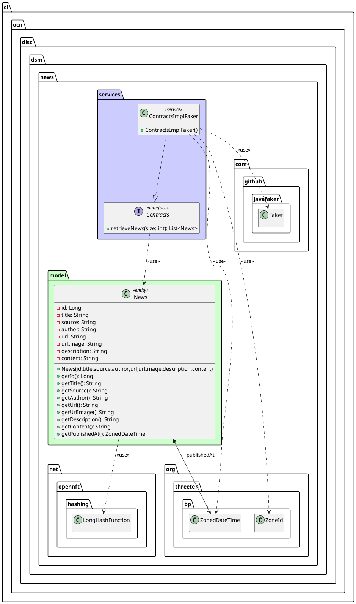

# THE NEWS PROJECT /2021

An android project who shows a list of News.

## Class Model

```puml
@startuml
package cl.ucn.disc.dsm.news{

    package org.threeten.bp{
        class ZonedDateTime{  
                
        }        
        class ZoneId {
         '''
         
        }
        
       
          
    }
    
    package com.github.javafaker{
        class Faker{
        
        }
    }
    
    package net.opennft.hashing{
        class LongHashFunction {
        }
    }
    
    
    package model #ccffcc {
        
        class News<<entity>> {
            -id: Long
            -title: String
            -source: String
            -author: String
            -url: String
            -urlImage: String
            -description: String
            -content: String
            +News(id,title,source,author,url,urlImage,description,content)
            +getId(): Long
            +getTitle(): String
            +getSource(): String
            +getAuthor(): String
            +getUrl(): String
            +getUrlImage(): String
            +getDescription(): String
            +getContent(): String
            +getPublishedAt(): ZonedDateTime            
        
        }               
        
        News..>LongHashFunction : <<use>>
        News *--> "1" ZonedDateTime : -publishedAt
    }
    
    package services #ccccff {
        interface Contracts <<interface>>{
            +retrieveNews(size: int): List<News>
        }
        Contracts ..> News : <<use>>   
        
        class ContractsImplFaker<<service>> {
            + ContractsImplFaker()
        
        }
        ContractsImplFaker ..|> Contracts    
        ContractsImplFaker ..> ZonedDateTime : <<use>>
        ContractsImplFaker ..> ZoneId : <<use>>
        ContractsImplFaker ..> Faker : <<use>>
    }
    

}
@enduml

```

## LICENSE

[MIT] (https://choosealicense.com/license/mit/)
